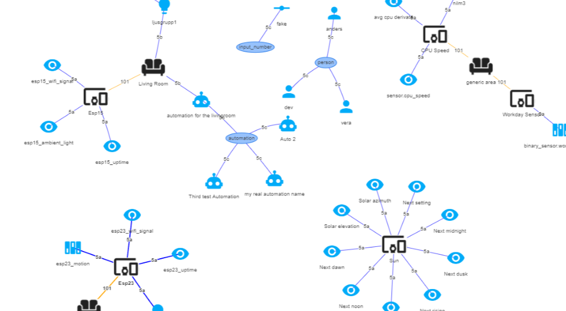

# CONFIG ANALYZER

## Abstract
The `config_analyzer` integration provide a framework along with multiple plugins for visualizing and exporting your Home Assistant configuration.

The primary objective is to facilitate a thorough review of your configuration through innovative perspectives.

## Installation
- Manual
    - Copy files from `custom_components/config_analyzer` into your Home Assistant `config` folder and restart Home Assistant.
    - On the integration page, click add integration and search for `config_analyzer` and add it.
[](https://my.home-assistant.io/redirect/config_flow_start/?domain=config_analyzer)

- HACS
    - add `https://github.com/ahd71/config_analyzer` as custom repository, search for config_analyzer and install as usual.

# Usage
The integration expose a single service named `run`.

After completion the results will be available in the `custom_components/config_analyzer/output` folder and `sensor.last_analyzed` will be updated with timestamp of completion.

The action could for example be made available in the UI with the following yaml code.

The service may take parameters used in the plugins and if so are described under respective plugin.

```
type: button
tap_action:
    action: call-service
    service: config_analyzer.run
    target: {}

```


# Plugins
Plugins are loaded from the `plugins` folder dynamically, not even a code change requires a restart, or any service calls, in Home Asisstant to be effective immidately.
All `.py` files in the `plugins` folder will be executed. If you don't want to use a plugin you can delete it or rename the suffix (I plan to have configuration to handle enable/disable). As a proof of concept I've created a few basic ones which hopefully will evolve. Ideas and contributions are welcome!

### Automation Overview
It's hard to get an overview when you get sufficient amount of automations. This plugin show all automations with their raw trigger/condition/action in columns.


### Excel Export
Export a list of devices, entities and area with the most important columns.


### Network Graph Export

Ever wonder how your devices, entities, automations etc related to each other? A network graph may reveal configuration inconsistancies and dependencies that isn't easily seen in the native GUI. Such as entites not related to an area.

For advanced analyzis the network graph is exported as a `.gexf` file that can be viewed in [Gephi](https://gephi.org/)



### HTML Documentation

### Group and Scene Matrix views
*(Planned)*

To give overview and spot inconsistancies show the relation between groups and entities or scene and entities.

### References to missing entities (planned)
*(Planned)*

## Known Issues
- `sensor.last_analyzed` isn't registered until first run. Any hints on how to achieve that is welcome!

## Disclaimers
This integration is in a early development stage and I may change some core concepts. I'm rather new to python and totally new to Home Assistant integration development. I appreciate feedback and hints on better way to achieve results!

## TODO or Work in progress:
- Allow only one instance to be setup
- Extract entities and service calls from automations
- Register the sensor on startup
- Make a plugin base class and have plugin inherit that one
- Error Handling
    - assert error on plugin execution failed and return error in state attribute
- Features
    - enable/disable plugins via config
- Network Export
    - use "original_device_class", e.g "signal_strength" and "device_class" instead of domain

